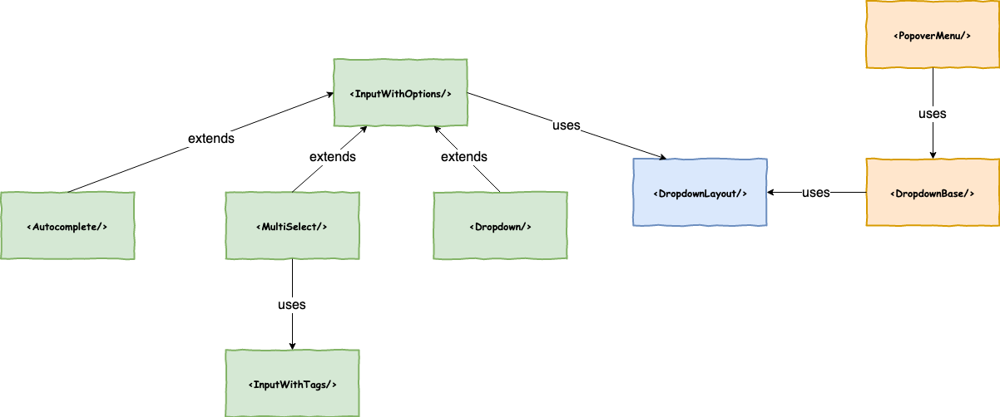

# Frequently Asked Questions

If you don't find your answer here, please open an issue or ask on our slack channel -
`#wix-style-react`.

Please create a pull request with the solution if it worth sharing.

<br/>

- [Usage issues](#%f0%9f%91%a8%e2%80%8d%f0%9f%8f%ab-usage-issues)
  - [How should I import a component properly?](#how-should-i-import-a-component-properly)
  - [Making Server-Side-Rendering (SSR) work](#making-server-side-rendering-ssr-work)
  - [Components do not have styling in the first render of Server-Side-Rendering (SSR)](#components-do-not-have-styling-in-the-first-render-of-server-side-rendering-ssr)
  - [My PR was merged, why can't I see it in my project?](#my-pr-was-merged-why-cant-i-see-it-in-my-project)
  - [I getting a weird error when using some components' TestKit?](#i-getting-a-weird-error-when-using-some-components-testkit)
    - [`TypeError: document.x is not a function`](#typeerror-documentx-is-not-a-function)
  - [How can I get colors and fonts to use in my project?](#how-can-i-get-colors-and-fonts-to-use-in-my-project)
  - [How does look the Dropdown family?](#how-does-look-the-dropdown-family)
  - [What are the differences between `<Box/>`, Grid's family and Layout's family?](#what-are-the-differences-between-box-grids-family-and-layouts-family)
- [Contributing issues](#%f0%9f%92%81%e2%80%8d%e2%99%82%ef%b8%8f-contributing-issues)
  - [Created a PR but the build is failing on CI, should I do something?](#created-a-pr-but-the-build-is-failing-on-ci-should-i-do-something)
  - [How can I run only one test locally?](#how-can-i-run-only-one-test-locally)
  - [I have a request for a feature or a new component. How can I get it?](#i-have-a-request-for-a-feature-or-a-new-component-how-can-i-get-it)

<br/>

## 👨‍🏫 Usage issues

### How should I import a component properly?

Currently, as the library does not support tree-shaking, the recommended way to `import` a component
is using the entry file of the component, and **not** importing from the index file:

```js
import Button from 'wix-style-react/Button';
```

`import`ing a component directly from `dist/src` is strongly prohibited.

### Making Server-Side-Rendering (SSR) work

You may receive an error like this one: `TypeError: (0 , _TextSt2.default) is not a function`.

In that case, ensure your generated `index.js` invokes `attachHook` from `@stylable/node`:

```diff
modified: my-generated-project/index.js
 const { wixCssModulesRequireHook } = require('yoshi-runtime'); //hook to `.scss` files
+const { resolveNamespaceFactory, attachHook } = require('@stylable/node'); //hook to `.st.css` files
+const {name} = require('./package.json');

wixCssModulesRequireHook();
+attachHook({
+  stylableConfig: {
+    resolveNamespace: resolveNamespaceFactory(name)
+  }
+});
```

### Components do not have styling in the first render of Server-Side-Rendering (SSR)

Components that use Stylable may not receive their styling on the first render (while other components styled with Css-Modules are working fine).
In that case it means that your Stylable configuration with Yoshi is set to inject styling tags to the header of the html document.
You need to change the config in order for the styling to be bundled as a separate css, like css-modules.

Steps to fix it:

1. inside your package.json modify the config inside yoshi part like this:

```
  "yoshi": {
  ....
    "enhancedTpaStyle": true,
  ...
  }
```

2. build your app
3. a generated stylable css is now created in your statics - `{your-app}/dist/statics/app.stylable.bundle.css`
4. import that css in your index.ejs (like your normal app.css) is imported.

`<link rel="stylesheet" href="<%= clientTopology.staticsBaseUrl %>app.stylable.bundle">`

### My PR was merged, why can't I see it in my project?

You PR might've merged into the `master` branch, but a new version containing it was not released
yet. You can contact the WSR team (on Slack) to request a release.

### I getting a weird error when using some components' TestKit?

##### `TypeError: document.x is not a function`

You might need to include a Polyfill in your test file. We provide some [essential
polyfills](../../testkit/polyfills/index.js), you may use them in the following way:

```js
import { rangePolyfill } from 'wix-style-react/dist/testkit/polyfills';

beforeEach(() => {
  rangePolyfill.install();
});

afterEach(() => {
  rangePolyfill.uninstall();
});

// ...
```

Check out the documentation of the component you're using for more info.

### How can I get colors and fonts to use in my project?

We recommend using the [Typography
components](https://wix-wix-style-react.surge.sh/?selectedKind=1.%20Foundation&selectedStory=1.2%20Typography&full=0&addons=0&stories=1&panelRight=0)
in order to get the right colors and fonts. Alternatively, if these components does not suit your
needs, you can use the [Typography
classes](https://wix-wix-style-react.surge.sh/?selectedKind=Styling&selectedStory=1.2%20Typography%20Classes&full=0&addons=0&stories=1&panelRight=0)
instead.

Also check out the
[`<Box/>`](https://wix-wix-style-react.surge.sh/?selectedKind=Components&selectedStory=Box&full=0&addons=0&stories=1&panelRight=0)
component for using correct colors and fonts.

### How does look the Dropdown family?



### What are the differences between `<Box/>`, Grid's family and Layout's family?

In short:

* `<Box/>` is a one-dimensional component that contains children and allows layouting them in a particular direction (horizontally or vertically). Mostly useful for small areas.
* Grid is a two-dimensional component family that layouts children into rows that are divided by 12 columns at most. Mostly useful for medium/large areas.
* Layout is a flexible component family that layouts children by cells that are placed into rows automatically. It's flexible compared to Grid because we can control stuff like the maximum amount of rows and gaps. Mostly useful for medium/large areas.

Check out [this](../usage/LAYOUTING.md) guide to learn more about layouting.

<br/>

## 💁‍♂️ Contributing issues

### Created a PR but the build is failing on CI, should I do something?

You should investigate the failing build and fix it. Sometimes, your build might be failing because
of a flaky test, so re-running it may solve the issue.

### How can I run only one test locally?

For component tests (file ending with `.spec.js`) we're using jest. You can add a `.only` flag to
your `it` / `describe` in order to make it focused, but you'll need to run only the file containing
the test. You can start watch mode by running `$ npm run test:watch`, then pressing `p` in order to
filter your specific test file.

For e2e tests we're using `protractor`, which uses `jasmine` under the hood. You can make an `it` or
`describe` block focused by prefixing it with a `f`, so `it` will turn to `fit` and `describe` will
turn to `fdescribe`.

⚠️ **Make sure to not push focused tests. Your build will fail when you do.**

### I have a request for a feature or a new component. How can I get it?

Simply [open a new issue!](https://github.com/wix-private/wsr-issues/issues/new) Even better, you
can also open a PR is you'd like! We'll love to accept new contributions 😄.
