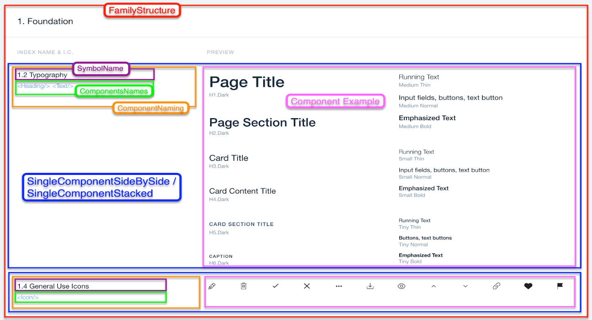

# Cheatsheet Contribution

## Symbols & Components Terminology

1. `Symbol` is the visual Sketch representation of the UI Component.
2. `Component` is the actual implementation of the UI element.
3. `Component Story` is the documentation page which explains how to use the component.
4. `UX Story` is the documentation page which reflects the `Symbol` constrains.


## Motivation
* **Components Inventory-** improving the components discoverability.
* **Mapping Symbol to Components-** making sure that we are aligned `Symbol <=> Component` as much as possible.
* **Source of truth**
* **Bridge the gap between the design and the actual implementation:**
    * Helping the FEDs to understand which components to use based on the UX symbol which is displayed in the Zeplin files.
    * Helping the UX Designers & Product to understand how the components behave and implemented.


## Contribution Guide

Lets say that I would like to add `3.1 Text Input` => `<Input/>`, `<FormField/>` to the cheatsheet.
* Symbol Group / Family - `3. Inputs`
* Symbol- `3.1 Text Input`
* Components- `<Input/>`, `<FormField/>`

### Files to update:
<pre>
stories/
├── Introduction/Cheatsheet/componentsFamilies/<b>InputFamily.js</b>   # usage example
└── symbolsComponentsMapping
    ├── symbols.js                                              # symbol name
    ├── components.js                                           # components used for this symbol
    ├── storybookMapping.js                                     # actual storybook naming
    └── families/<b>inputsFamily.js</b>                                # mapping to te relevant family
    
<b>* Change component family marked in bold to the family relevant to your component.</b>
</pre>


### A. Map the symbol to the components names:
* Add a symbol name to `stories/symbolsComponentsMapping/symbols.js`.

```js
export const inputsSymbols = {
  textInput: '3.1 Text Input',
  ...
};
```

* Add the components used for this symbol to `stories/symbolsComponentsMapping/components.js`.
```js
// Add here all components which are shared with mutiple famelies.
export const sharedComponentsNames = {
  ...
  FormField: 'FormField',
};

// Add here all components related to the Input Family
export const inputsComponentsNames = {
  Input: 'Input',
  ...
};
```
* Add the `Symbol => Components` mapping to te relevant family file (listed under the `families` directory).

```js
// file: symbolsComponentsMapping/families/inputsFamily.js

import { inputsSymbols } from '../symbols';
import {
  inputsComponentsNames as componentsNames,
  sharedComponentsNames,
} from '../components';


export const inputsSymbolsToComponents = {
  ...

  [inputsSymbols.textInput]: [
    sharedComponentsNames.FormField,
    componentsNames.Input,
  ],

  ...
};

```

* **(optional)** Add the actual symbol and / or actual component name `stories/symbolsComponentsMapping/storybookMapping.js`


**Note:** This mapping can be used to get the `Component` / `Symbol` URLs and therefore should be maintained.


### B. Add an example to the cheatsheet:

#### Shared UI elements arcitecture:
.

The cheatsheet is listed under `stories/Introduction/Cheatsheet`.
1. Use the shared UI Components listed under `stories/Introduction/Cheatsheet/sharedComponents` to design the example layout.
2. Import the new component to the relevant family file in `componentsFamilies` directory
3. Get the relevant `Symbol => Components` mapping (Step 3 above).
4. Use the utils listed under `stories/Introduction/Cheatsheet/sharedComponents/utils.js` to link the symbols & components to the relevant documentation page.
5. Implement the example and add it to the `<FamilyStructure/>`.


```jsx
//File stories/Introduction/Cheatsheet/componentsFamilies/InputFamily.js


// Step 2
import Input from 'wix-style-react/Input';
import FormField from 'wix-style-react/FormField';

const groupSymbol = symbolsGroup.inputs;

// Step 5
const TextInputExample = () => {

  // Step 3
  const symbol = inputsSymbols.textInput;
  const components = inputsSymbolsToComponents[symbol];

  const singleComponentProps = {
    name: createLinkedSymbolName({ groupSymbol, symbol }), //Step 4
    componentsNames: createLinkedComponentsNames(components), //Step 4
    size: singleComponentSizes.compact,
  };

  return (
    // Step 1
    <SingleComponentSideBySide {...singleComponentProps}>
      <FormField label="Text Input">
        <Input placeholder="Value" />
      </FormField>
    </SingleComponentSideBySide>
  );
};


const InputFamily = () => (
  <FamilyStructure title={groupSymbol} showPreview>
    ...
    // Step 5
    <TextInputExample />
    ...
  </FamilyStructure>
);

export default InputFamily;

```
